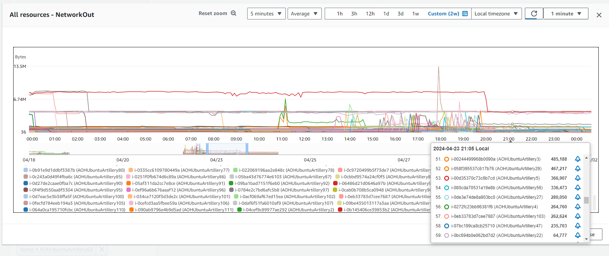
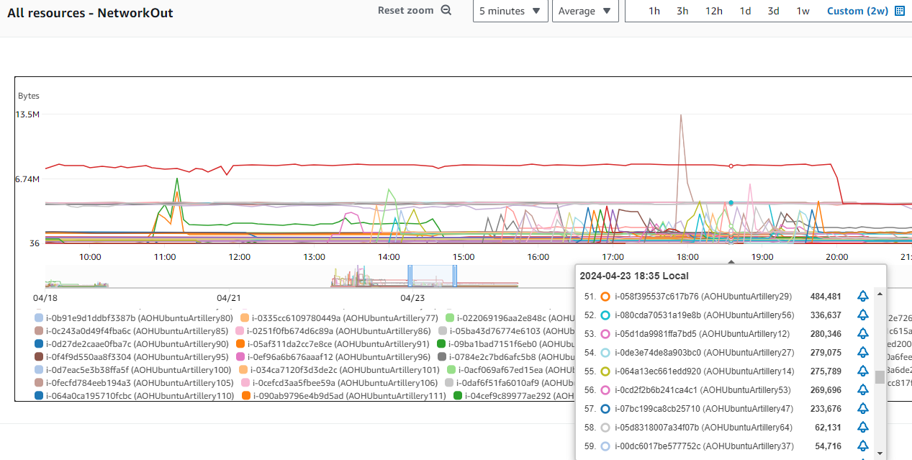
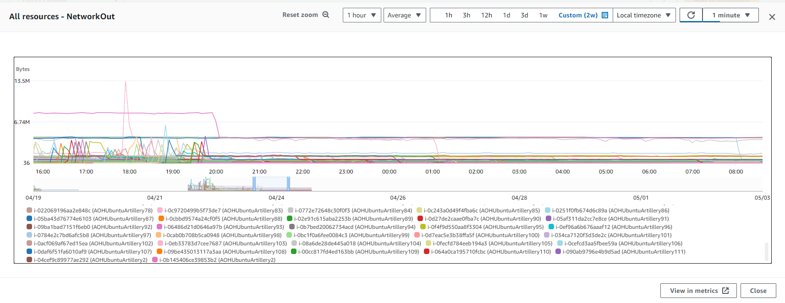
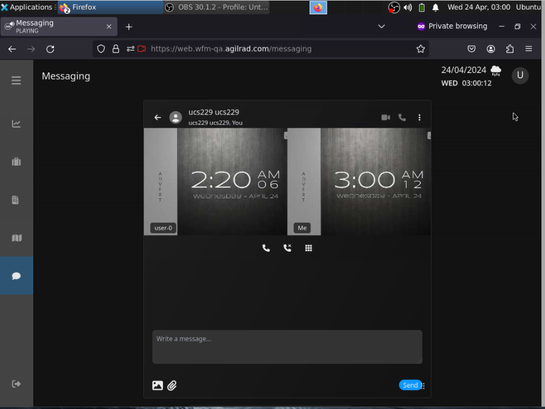
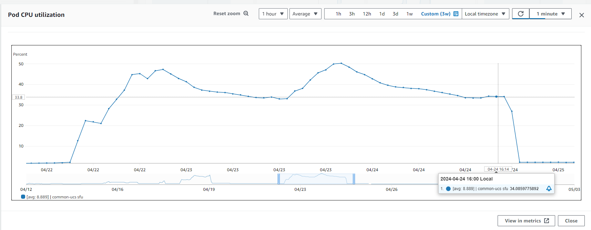
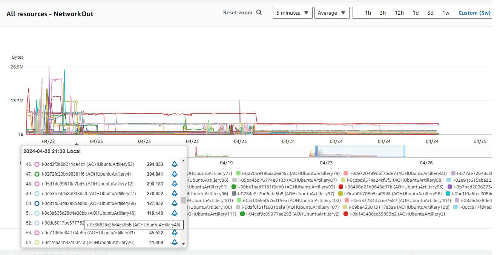

# UCS/SFU Loadtesting 
Objective: 

### AOH Cluster setup used for the test
Environment:                        wfm-qa
Cloud provider:                     AWS
Number of Cores in the AOH cluster: 8
Number of nodes for cluster:        4
Number of cores for SFU:            2
Size of RAM:                        32GB
Storage class:                      gp3

## These are the test setup

### EC2 instances testing machine
Number of Cores: 4
Class of EC2: t3a.xlarge
RAM size: 16GB
EBS class : gp2

### SFU configuration
maxbandwidth = 1500kbps
maxpackettrack = 500

### loadtest targets
Minimum Number of 1-1 video calls: 100
Minimum Number of streams: 200
Minimum Number of Users: 200

#### Additional Tools used:
 OBS (For Webcam simulation)
 Firefox

Websites used for webcam simulation
- https://www.clocktab.com/
- https://www.timeanddate.com/worldclock/
- https://www.changiairport.com/
- https://www.youtube.com/watch?v=LDU_Txk06tM

#### actual communication model

All clients will send their video stream to the SFU, and will receive streams from other users through the SFU.

---
title: 2 Test steps
---
<!-- Chapter content here -->

### 
1) EC2 of type t3a.xlarge is spawned
2) Firefox, OBS, webcam simulator stream is installed
3) Webcam simulator is started, OBS is started
3) 1st User insteance is started up and logged in for Firefox, 1-1 video call is engaged with 2nd User
4) 2nd User instance is started up and logged in in Firefox private mode. 1-1 vidoe call is engaged with 4th User
5) Another EC2 is spawned.
6) Firefox, OBS, webcam simulator stream is installed 
7) Webcam simulator is started, OBS is started
8) 3rd User insteance is started up and logged in for Firefox, 1-1 video call is engaged with 1st User
9) 4th User instance is started up and logged in in Firefox private mode. 1-1 vidoe call is engaged with 2nd User
10) The process is repeated until the targetted number of users are spawned.

 However, due to  time and money constrain, the test was stopped on the forth day.

### results

Figure 1a graph of EC2 with one or two streams output running

Figure 1b graph of EC2 with 

From figure 1b,around 1835hrs on 23rd April, you can observe that most EC2s will converge to about 1.58MBps when two streams is up, and around 550kBps in Figure 1a when one steam upload is happening.
The total streams translate to 84 streams, with 27 EC2 with 2 streams, and 30 streams with 1 stream.

Figure 2a graph of EC2 with one or two streams input running

Figure 2b graph of EC2 with at least one streams input running

From figure 2, you can observe that the EC2s are also ingesting.

From Figure 2, around 1730hrs on 23rd April, you can observe that more tha 27 EC2s have bandwidth ingesion running at around 1.1MBps, which indicates that there are two streams running and 30 EC2s running around 200 - 600kBps, which inidicates that it is running at least 1 stream. It also means that there are at least 84 streams being ingested at the same time.

### observation
#### 1) Most stream are around 200-600kB. 
#### 2) streams drop/disconnects after sometime

Figure 3a Network graph showing streams dropping as time passes

Figure 3b 

Figure 3c

From figure 3b and 3c, you can observe two different clients displaying the last frame of the video call that they received. Restarting the video call at the sender side will cause the video to be refreshed.

#### 3) After the 2nd drop, the EC2 will not to be streaming any data until the UCS front end is restarted 
#### 4) It seems that the SFU  converges to CPU 34%

Figure 4 CPU comsumption of SFU over time

From Figure 4, you can observe the CPU usage of the SFU over the testing period. 
-- the Highest usage recorded is about 50%, which translate to a consumption of 1 core, and about 80 streams

Figure 5a 30 ec2 of 2 streams at the end of day 1

Figure 5b 20 ec2 of 1 streams at the end of day 1

#### some statistic for the sfu
1) Max UDP byte process per seconds handled by SFU (up/down): 562kbps
2) Max CPU utilisaton for sfu pod/service: 50%
3) Max Memory utilitsation for sfu pod/service: 14%
4) Max Node CPU utilisation: 63.4%
5) Average Node memory utilisation: 51%

## Appendix A OBS as a virtual webcam

Apart from steaming a PC screen to major streaming sites,  OBS can emulate a webcam onto the client using the many source capture tools the OBS offers. For this test, the browser capture tool allows a user to load a webpage directly. 

## Appendix B why Spawn EC2 instance instead of spawing VMs on local servers
The bandwidth of the office to the wfm-qa environment is 99mbps. To prevent any bottle neck, it was decided to do future tests in the EC2 when possible.

Sample max network activity of 305 MBps recorded